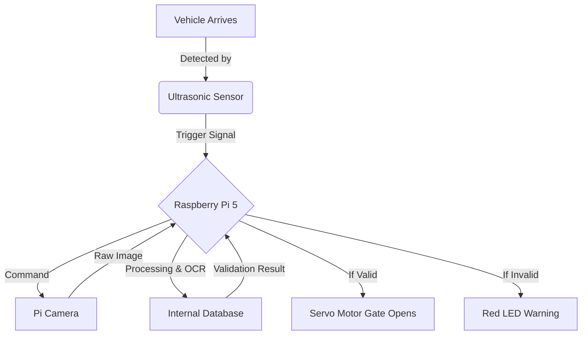

# Smart City ALPR: Automated Contactless Entry System 

An IoT-based Automatic License Plate Recognition (ALPR) system built using Computer Vision and Raspberry Pi to enable contactless vehicle entry through smart gate automation.

This project demonstrates how Smart City infrastructure can automate vehicle access, reduce congestion, and enhance security by replacing manual gate checks with real-time license plate recognition.

---

# Project Overview

Traditional entry systems such as manual guard checks or RFID cards have several problems:

- Human error during verification
- High operational costs
- Traffic congestion at entry gates
- Security risks from lost or shared access cards

## Objective

Design a contactless automated gate system that:

- Detects approaching vehicles
- Reads license plates using OCR
- Validates against an authorised database
- Automatically opens the gate if authorised

---

# System Workflow

1. **Vehicle Detection**  
   An Ultrasonic Sensor detects a vehicle approaching the gate.

2. **Image Capture**  
   The Raspberry Pi Camera captures an image of the vehicle's license plate.

3. **Image Processing**
   - Convert image to grayscale
   - Remove noise
   - Detect plate region
   - Crop license plate

4. **Text Extraction**
   OCR extracts alphanumeric text from the license plate.

5. **Validation**
   The detected plate number is compared against the authorised database.

6. **Action**
   - ✅ Match Found → Gate opens, green LED ON  
   - ❌ No Match → Red LED flashes, access denied

---

# System Architecture



---

# Hardware Components

| Component | Description |
|---|---|
| Controller | Raspberry Pi 5 (4GB / 8GB) |
| Camera | Raspberry Pi Camera Module V2 (8MP) |
| Actuator | MG996R High Torque Servo Motor |
| Sensor | HC-SR04 Ultrasonic Sensor |
| Cooling | Raspberry Pi Active Cooler |
| Power Supply | Official 27W USB-C Power |
| Servo Power | 4xAA Battery Pack (6V) or 5V 2A adapter |
| Protection | Voltage Divider (1kΩ & 2kΩ resistors) |

Important: Raspberry Pi 5 requires a Mini-to-Standard camera adapter cable.

---

# Software Stack

| Technology | Purpose |
|---|---|
| Python 3.11+ | Main programming language |
| Raspberry Pi OS (Bookworm 64-bit) | Operating system |
| OpenCV | Image processing |
| Tesseract OCR | License plate text recognition |
| Pandas | Managing authorised vehicle database |
| RPi.GPIO / lgpio | Sensor and motor control |

---

# Authorised Vehicle Database

The prototype uses a simple Allow List stored in CSV or Python list.

## Sample Allowed Plates

```
MH12DE1433
DL4CAF4923
KA03HA1999
```

## Sample Denied Plates

```
MH00XX0000
Unreadable plates
Unregistered vehicles
```

---

# Use Cases

### Residential Complexes
Automatic entry for residents.

### Corporate Offices
Employee vehicle management.

### Toll Booths
Automatic toll collection using plate recognition.

### Smart Parking Systems
Entry/exit logging and parking fee calculation.

---

# Reliability Features

## OCR Error Handling

- **Majority Voting:** 3–5 frames captured and the most consistent result is selected.
- **Fuzzy Matching:** Accepts ~85% similarity to handle character confusion like O vs 0.

## Lighting Control

- Automatic LED flash illumination
- Adaptive thresholding for shadows and uneven lighting

## Mechanical Failures

- Manual override button
- Separate power supply for servo motor

---

# Demo Scenario

Example demonstration:

| Time | Event |
|---|---|
| T+0s | Toy car stops 10cm from sensor |
| T+0.2s | Sensor detects object |
| T+0.5s | Plate recognised on screen |
| T+0.6s | Gate opens automatically |
| T+5s | Gate closes after vehicle passes |

Example Plate Used:

```
MH12DE1433
```

---


# Future Improvements

- Real-time cloud database integration
- Mobile app for visitor access approval
- Automatic parking management system
- Integration with city traffic infrastructure
- Machine learning model for higher plate detection accuracy

---

# License

This project is open-source and available under the MIT License.

---


